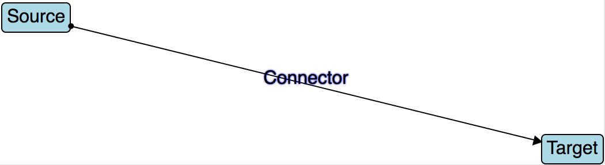

# SVG Connectors

Create connector elements in SVG which connect two DOM elements together!



## Usage

See `src/site`

## Build

1. [Install node](http://nodejs.org/download/)
1. Run:
```bash
git clone https://github.com/thSoft/SvgConnectors.git
cd SvgConnectors/build
./init
./view
```